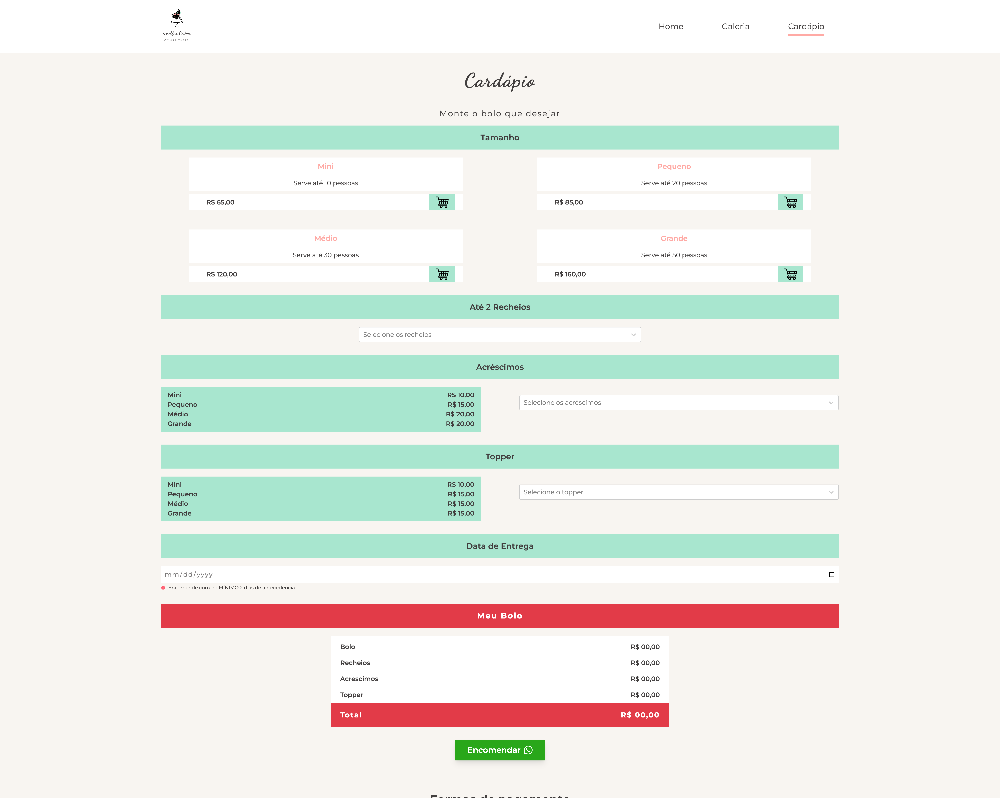
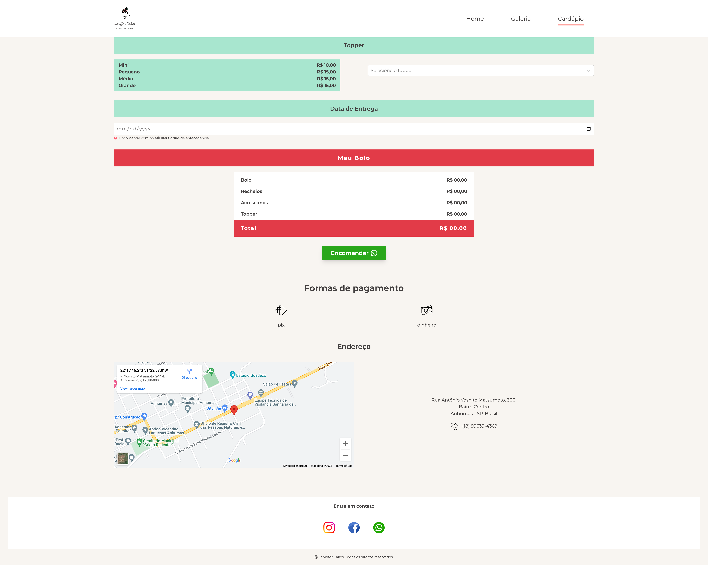

# Jeniffer Cakes - A Client Website

Jeniffer Cakes is a website made for a client. The main goal of this website is to to display her work and make it easier for a client to order a cake. On the website the user can have excess to her work and create the order without a need for endeless conversations via website. All the necessary information is together in one place.

### Check out JenifferCakes [here](https://jeniffercakes.com.br/)

## Development Process

- Meetings with the client to understand her businees, services offered and already existing clients;
- Brainstorming the key concepts to compose the storytelling;
- Creating low fidelity design for client approval;
- Choose bran colors and design the logo;
- Content creation;
- Criation  of high fidelity web design on Figma;
- Implementation of the frontend website using NextJS from a mobile-first perspective;
- Testing and feedback;
- Deploy.

## Built with

- Semantic HTML5 markup;
- Tailwindcss framework;
- NextJS;
- Mobile-first workflow.

## Technologies and Tools

- [NextJS - JS library](https://nextjs.org)
- [Tailwindcss](http://tailwindcss.com)

## Useful resources
- [Next.js vs React: The Difference and Which Framework to Choose](https://ninetailed.io/blog/next-js-vs-react/): This article gives an overview about two frameworks: React and Next. It also gives as a comparison between. We recommend the reading for anyone who isn't sure which of those two frameworks to work on a project.

## Acknowledgments
This is website is made by two developers as a team.

### Made with :heart: by [Eduardo Arakaki] (https://www.linkedin.com/in/eduardo-arakaki/) and [Caroline Almeida Nikolic] (https://www.linkedin.com/in/carolinealmeidanikolic/)